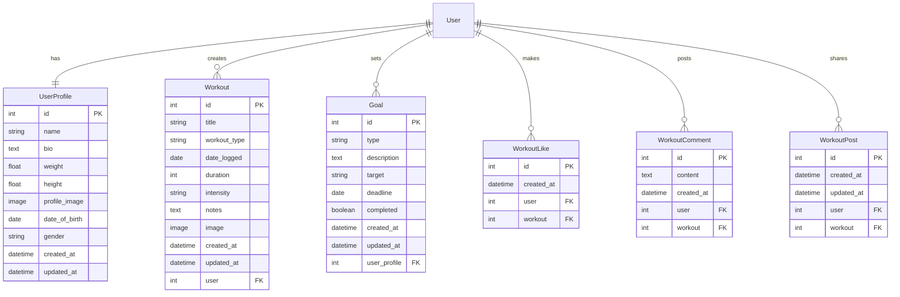

# FitPro API Backend

[](https://python.org)
[](https://www.djangoproject.com/)
[](https://www.django-rest-framework.org/)
[](LICENSE)

## Table of Contents

1. [Overview](#overview)
2. [Features](#features)
3. [Database Design](#database-design)
4. [API Endpoints](#api-endpoints)
5. [Models](#models)
6. [Views & Serializers](#views--serializers)
7. [Authentication](#authentication)
8. [Testing](#testing)
9. [Deployment](#deployment)

## Overview

FitPro's backend API provides comprehensive fitness tracking functionality with:

- JWT-based authentication
- Workout tracking and analysis
- Social features and interactions
- Statistical reporting
- Goal setting and monitoring

## Features

### Core Features

- User authentication and profile management
- Comprehensive workout tracking
- Social interactions (likes, comments, follows)
- Goal setting and progress monitoring
- Statistical analysis and reporting

## Database Design




## Models

### Workout Model

```python
class Workout(models.Model):
    WORKOUT_TYPES = [
        (CARDIO, 'Cardio'),
        (STRENGTH, 'Strength Training'),
        (FLEXIBILITY, 'Flexibility'),
        (SPORTS, 'Sports'),
        (OTHER, 'Other'),
    ]

    INTENSITY_LEVELS = [
        (LOW, 'Low'),
        (MODERATE, 'Moderate'),
        (HIGH, 'High'),
    ]

    title = models.CharField(max_length=200, default="My Workout")
    user = models.ForeignKey(User, on_delete=models.CASCADE)
    workout_type = models.CharField(max_length=100, choices=WORKOUT_TYPES)
    date_logged = models.DateField(default=timezone.now)
    duration = models.IntegerField(validators=[MinValueValidator(1), MaxValueValidator(1440)])
    intensity = models.CharField(max_length=20, choices=INTENSITY_LEVELS, default=MODERATE)
    notes = models.TextField(blank=True)
    image = CloudinaryField('image', blank=True, null=True)
    created_at = models.DateTimeField(auto_now_add=True)
    updated_at = models.DateTimeField(auto_now=True)

    class Meta:
        ordering = ['-date_logged', '-created_at']
```

### Profile Model

```python
class UserProfile(models.Model):
    GENDER_CHOICES = [
        ('M', 'Male'),
        ('F', 'Female'),
        ('O', 'Other'),
    ]

    user = models.OneToOneField(User, on_delete=models.CASCADE)
    name = models.CharField(max_length=100, blank=True)
    bio = models.TextField(max_length=500, blank=True)
    weight = models.FloatField(null=True, blank=True)
    height = models.FloatField(null=True, blank=True)
    profile_image = CloudinaryField('image', folder='profile_images')
    date_of_birth = models.DateField(null=True, blank=True)
    gender = models.CharField(max_length=1, choices=GENDER_CHOICES)
```

## Views & Serializers

### Workout Views

```python
class WorkoutViewSet(viewsets.ModelViewSet):
    serializer_class = WorkoutSerializer
    permission_classes = [permissions.IsAuthenticated, IsOwnerOrReadOnly]
    
    def get_queryset(self):
        return Workout.objects.filter(user=self.request.user)

    @action(detail=False, methods=['GET'])
    def statistics(self, request):
        queryset = self.get_queryset()
        stats = {
            'total_workouts': queryset.count(),
            'total_duration': queryset.aggregate(Sum('duration'))['duration__sum'],
            'workout_types': queryset.values('workout_type').annotate(
                count=Count('id')
            )
        }
        return Response(stats)
```

### Serializers

```python
class WorkoutSerializer(serializers.ModelSerializer):
    username = serializers.ReadOnlyField(source='user.username')
    has_liked = serializers.SerializerMethodField()
    
    class Meta:
        model = Workout
        fields = [
            'id', 'username', 'title', 'workout_type',
            'date_logged', 'duration', 'intensity',
            'notes', 'has_liked', 'created_at'
        ]
```

## API Endpoints

### Authentication

```python
urlpatterns = [
    path('auth/login/', obtain_auth_token),
    path('auth/register/', RegisterView.as_view()),
    path('auth/logout/', LogoutView.as_view()),
]
```

### Workouts

```python
urlpatterns = [
    path('workouts/', WorkoutViewSet.as_view({'get': 'list', 'post': 'create'})),
    path('workouts/<int:pk>/', WorkoutViewSet.as_view({
        'get': 'retrieve',
        'put': 'update',
        'delete': 'destroy'
    })),
    path('workouts/statistics/', WorkoutViewSet.as_view({'get': 'statistics'})),
]
```

### Social

```python
urlpatterns = [
    path('feed/', SocialFeedView.as_view()),
    path('comments/', CommentViewSet.as_view({'get': 'list', 'post': 'create'})),
    path('likes/', LikeView.as_view()),
]
```

## Middleware

### Custom Middleware

```python
class RequestLoggingMiddleware:
    def __init__(self, get_response):
        self.get_response = get_response

    def __call__(self, request):
        logger.info(f"Request: {request.method} {request.path}")
        response = self.get_response(request)
        return response

class RateLimitMiddleware:
    def __call__(self, request):
        if not self.check_rate_limit(request):
            return HttpResponseTooManyRequests()
```

## Caching

Redis caching configuration:

```python
CACHES = {
    'default': {
        'BACKEND': 'django_redis.cache.RedisCache',
        'LOCATION': os.environ.get('REDIS_URL'),
        'OPTIONS': {
            'CLIENT_CLASS': 'django_redis.client.DefaultClient',
        }
    }
}
```

## Security

### CORS Configuration

```python
CORS_ALLOWED_ORIGINS = [
    "http://localhost:3000",
    "https://fittrack-frontend.herokuapp.com"
]

CORS_ALLOW_CREDENTIALS = True
```

### JWT Settings

```python
SIMPLE_JWT = {
    'ACCESS_TOKEN_LIFETIME': timedelta(minutes=5),
    'REFRESH_TOKEN_LIFETIME': timedelta(days=1),
    'ROTATE_REFRESH_TOKENS': True,
}
```

## Testing

- Due to time constraints and bad planning, Unit tests have not been done for this API.
- Pep8 Validation is not completely done for this project. Due to time contstraints.

<details>
  <summary>Pep8 for whats done</summary>
  
  

  

  

  

  

  

  

  

  

  

  

  

  

</details>

## Deployment

### Production Settings

```python
DEBUG = False
ALLOWED_HOSTS = ['https://fitnessapi-d773a1148384.herokuapp.com/']
DATABASES = {
    'default': dj_database_url.config(
        default=os.environ.get('DATABASE_URL')
    )
}
STATIC_ROOT = os.path.join(BASE_DIR, 'staticfiles')
MEDIA_ROOT = os.path.join(BASE_DIR, 'mediafiles')
```

### Environment Variables

```env
SECRET_KEY=your-secret-key
DATABASE_URL=your-database-url
CLOUDINARY_URL=your-cloudinary-url
REDIS_URL=your-redis-url
```

## Credits

- Daisy Mentor for insight and over being the best mentor i've ever had

### Tools & Libraries

- Django Rest Framework
- dj-rest-auth
- django-filter
- django-redis
- Cloudinary

### Resources

- DRF Documentation
- Django Documentation
- TestDriven.io

## License

This project is licensed under the MIT License - see the [LICENSE](LICENSE) file for details
