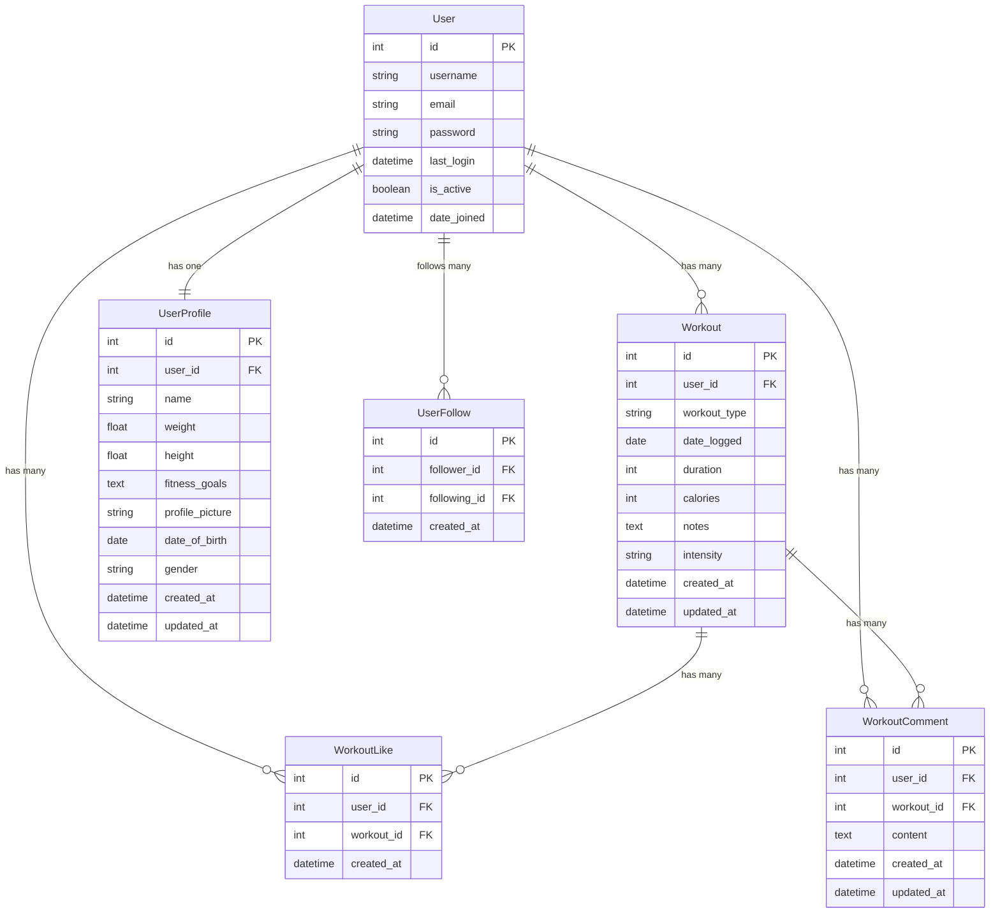

# Fitness API

A comprehensive Django REST API for fitness tracking with social features. This API enables users to track workouts, manage profiles, and engage with other fitness enthusiasts.

## User Stories & Implementation Status

### Authentication & Profile Management

1. User Registration #1 [COMPLETE]
   - As a: New user
   - I want to: Register an account
   - So that: I can log in and track my fitness activities

2. User Login #2 [COMPLETE]
   - As a: Registered user
   - I want to: Log in to my account
   - So that: I can access my profile and data

3. User Logout #3 [COMPLETE]
   - As a: Logged-in user
   - I want to: Log out
   - So that: I can secure my account when I'm finished

4. User Profile Setup #4 [COMPLETE]
   - As a: User
   - I want to: Set up my profile with details like weight and fitness goals
   - So that: I can personalize my fitness experience

5. Edit Profile #5 [COMPLETE]
   - As a: User
   - I want to: Edit my profile information
   - So that: I can keep my fitness data up to date

### Workout Management

6. Log Workouts #6 [COMPLETE]
   - As a: User
   - I want to: Log my workouts (type, duration, calories)
   - So that: I can track my fitness activities over time

7. View Past Workouts #7 [COMPLETE]
   - As a: User
   - I want to: View a list of my past workouts
   - So that: I can monitor my progress

8. Edit/Delete Workout #8 [COMPLETE]
   - As a: User
   - I want to: Edit or delete a workout entry
   - So that: I can correct any mistakes or remove outdated information

### Progress & Goals

9. Visualize Progress #9 [PARTIAL]
   - As a: User
   - I want to: Visualize my progress over time with charts
   - So that: I can see how I'm improving
   - Status: Basic metrics implemented, charts pending

10. Set Fitness Goals #10 [PLANNED]
    - As a: User
    - I want to: Set fitness goals
    - So that: I can stay motivated and track my achievements

### Social Features

11. Follow Other Users #11 [COMPLETE]
    - As a: User
    - I want to: Follow other users
    - So that: I can see their workouts and progress

12. View Followed Users' Feed #12 [COMPLETE]
    - As a: User
    - I want to: View a feed of workouts from users I follow
    - So that: I can stay connected and motivated by their activities

## Features Implementation Status

### Complete Features

- User Registration & Authentication
- Profile Management
- Workout Tracking & History
- Social Features (Following, Likes, Comments)
- Feed Generation
- Basic Progress Statistics

### Partially Complete Features

- Progress Visualization (Basic metrics implemented, charts pending)

### Planned Features

- Fitness Goals System
- Advanced Analytics
- Achievement System

## Database Schema

Our API uses a relational database with the following structure:




## Technical Stack

### Core Framework

- Django 5.1.2
  - Custom User Model
  - Extended Profile Model
  - Social Relations Models

### API Framework

- Django REST Framework 3.15.2
  - Custom Viewsets
  - Nested Serializers
  - Filter Backends

### Authentication

- JWT via djangorestframework-simplejwt
  - Token Refresh Mechanism
  - Custom Authentication Classes

### Database

- Development: SQLite
- Production: PostgreSQL

### Media Storage

- Cloudinary
  - Image optimization
  - Secure upload
  - CDN delivery

### Additional Components

- django-filter for advanced searching
- django-cors-headers for CORS
- dj-rest-auth for authentication flows
- whitenoise for static files
- Python-dotenv for environment management

## API Endpoints

### Authentication

```
POST   /api/auth/register/       - Register new user
POST   /api/auth/login/         - Login
POST   /api/auth/logout/        - Logout
POST   /api/auth/token/         - Get JWT token
POST   /api/auth/token/refresh/ - Refresh JWT token
```

### Profiles

```
GET    /api/profiles/me/                    - Get current user profile
PUT    /api/profiles/update_profile_picture/ - Update profile picture
GET    /api/profiles/                       - List profiles
PUT    /api/profiles/{id}/                  - Update profile
```

### Workouts

```
GET    /api/workouts/         - List workouts
POST   /api/workouts/         - Create workout
GET    /api/workouts/{id}/    - Get workout
PUT    /api/workouts/{id}/    - Update workout
DELETE /api/workouts/{id}/    - Delete workout
GET    /api/workouts/summary/ - Get workout stats
```

### Social

```
POST   /api/social/follows/follow/    - Follow user
POST   /api/social/follows/unfollow/  - Unfollow user
GET    /api/social/feed/              - Get social feed
POST   /api/social/likes/             - Like workout
DELETE /api/social/likes/{id}/        - Unlike workout
POST   /api/social/comments/          - Comment on workout
GET    /api/social/comments/{id}/     - Get workout comments
```

## Installation and Setup

### Prerequisites

- Python 3.8+
- pip
- virtualenv
- PostgreSQL (for production)

### Development Setup

1. Clone and Setup

```bash
# Clone repository
git clone <repository-url>
cd fitness-api

# Create virtual environment
python -m venv venv

# Activate virtual environment
# Windows:
venv\Scripts\activate
# Unix/MacOS:
source venv/bin/activate

# Install dependencies
pip install -r requirements.txt
```

2. Environment Configuration

```env
SECRET_KEY=your_secret_key
DEBUG=True
ALLOWED_HOSTS=localhost,127.0.0.1
DATABASE_URL=sqlite:///db.sqlite3
CLOUDINARY_URL=your_cloudinary_url
CORS_ORIGIN_WHITELIST=http://localhost:3000
```

3. Database Setup

```bash
python manage.py makemigrations
python manage.py migrate
python manage.py createsuperuser
```

## Testing

```bash
# Run all tests
python manage.py test

# Run specific tests
python manage.py test social.tests.SocialFeatureTests

# Coverage report
coverage run manage.py test
coverage report
```

## Contributing

1. Fork the repository

2. Create a feature branch

```bash
git checkout -b feature/your-feature-name
```

3. Commit your changes

```bash
git commit -m "type(scope): description"
```

4. Push to the branch

5. Create a Pull Request

## License

[Your chosen license]

## Support

For support, please open an issue in the GitHub repository or contact [contact information].
